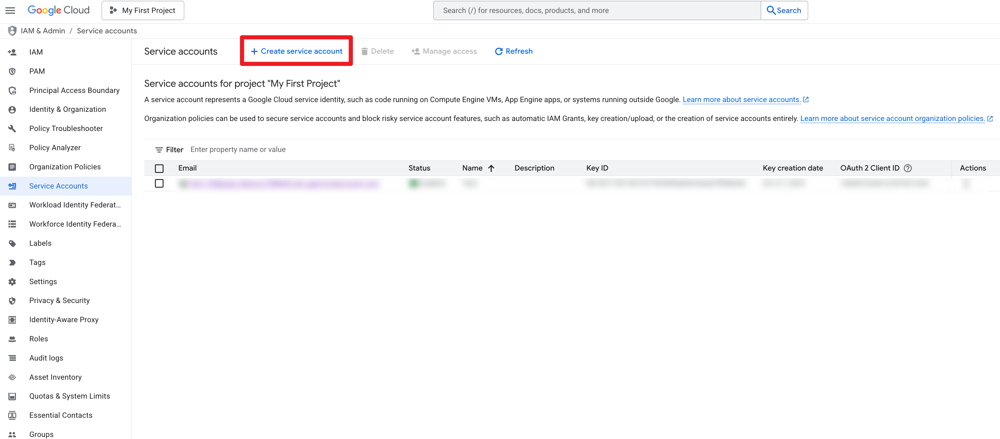
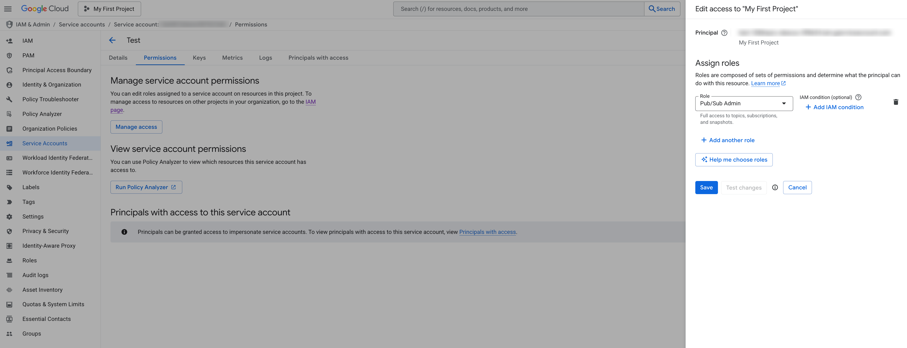
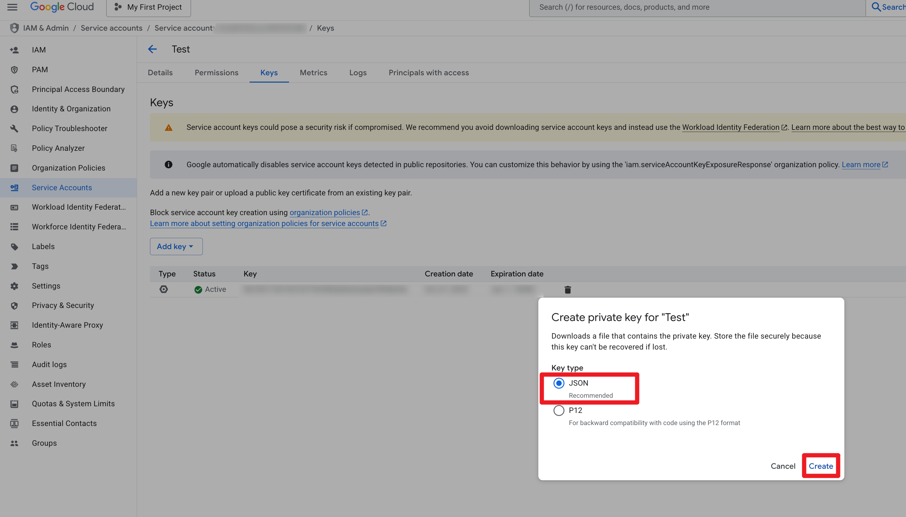
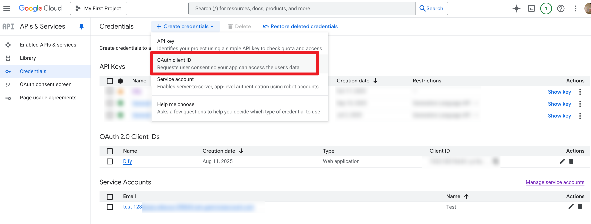

Gmail Trigger (Push + History)

Overview

- Gmail Trigger is a Dify provider that receives Gmail push notifications via Cloud Pub/Sub and emits concrete events based on Gmail History:
  - `gmail_message_added` (new messages)
  - `gmail_message_deleted` (deleted messages)
  - `gmail_label_added` (labels added to messages)
  - `gmail_label_removed` (labels removed from messages)
- Dispatch verifies/auths the push, pulls the history delta once, and splits changes for events to consume.
- Note: API Key is NOT supported for Gmail API access. Use OAuth (gmail.readonly) only.

Prerequisites

- A Google account authorized for Gmail API (used during OAuth)
- A Google Cloud project with Pub/Sub API enabled (configured at tenant-level by administrator)

Step-by-step Setup

1. Install the plugin in Dify

- Options:
  - If packaged as `.difypkg`, import it in Dify’s Plugin Center (Plugins → Import).
  - For local run during development, ensure the runtime installs dependencies in `requirements.txt`.

2. Configure GCP resources (Administrator, one-time setup)

- Create or select the Google Cloud project that will host your Pub/Sub resources. Make sure the following APIs are enabled _(APIs & Services → Library)_:
  - Gmail API: https://console.cloud.google.com/apis/library/gmail.googleapis.com
  - Cloud Pub/Sub API: https://console.cloud.google.com/apis/library/pubsub.googleapis.com
- Create a dedicated service account and grant Pub/Sub permissions:

  1. Go to IAM & Admin → Service Accounts → **Create Service Account**.  
     Console URL: https://console.cloud.google.com/iam-admin/serviceaccounts

     Screenshot:

     

  2. Assign the `roles/pubsub.admin` role to this service account or select "Pub/Sub Admin" role which already includes the necessary permissions (required so the plugin can create topics, subscriptions, and update IAM policies automatically).

     - Alternatively, a custom role must include: `pubsub.topics.create`, `pubsub.topics.getIamPolicy`, `pubsub.topics.setIamPolicy`, `pubsub.subscriptions.create`, `pubsub.subscriptions.get`, `pubsub.subscriptions.delete`, `pubsub.subscriptions.list`.

       Screenshot:

       

  3. Create a JSON key for this service account and download it securely.
     Screenshot:

     

- Note your Google Cloud **Project ID** (displayed on the project dashboard or IAM page).

3. Configure OAuth client for the plugin (Administrator, one-time setup)

- In Google Cloud Console → APIs & Services → Credentials → **Create Credentials** → OAuth client ID.  
  Console URL: https://console.cloud.google.com/apis/credentials

  Screenshot:

  

  - Application type: **Web application**
  - Authorized redirect URIs: copy the redirect URI shown in Dify when you set up the plugin (e.g., `https://<your-dify-host>/console/api/plugin/oauth/callback`)

- Capture the generated **Client ID** and **Client Secret** for later use.

4. Enter OAuth client parameters in Dify

- In the plugin configuration form:
  - `client_id`: The OAuth client ID created above.
  - `client_secret`: The corresponding client secret.
  - `gcp_project_id`: The Google Cloud project ID with Pub/Sub enabled.
  - `gcp_service_account_json`: Paste the full JSON key created for the service account (keep it private).
- Dify will automatically derive a per-user Pub/Sub topic when the end user authorizes the plugin.

5. User: Authorize and create subscription

- Click "Authorize" to complete OAuth (gmail.readonly scope)
- Create a Gmail subscription with optional parameters:
  - `label_ids` (optional): Scope to specific labels (INBOX, UNREAD, etc.)
    - Docs: https://developers.google.com/gmail/api/reference/rest/v1/users.labels/list
  - Properties (optional, for enhanced security):
    - `require_oidc`: Enforce OIDC bearer verification
    - `oidc_audience`: Webhook endpoint URL (auto-filled)
    - `oidc_service_account_email`: Service account used for Push subscription

What happens automatically:

- Plugin creates/reuses a Pub/Sub Topic in your GCP project
- Plugin grants Gmail API publisher permission to the topic
- Plugin creates a dedicated Push subscription for this user
- Plugin calls Gmail `users.watch` API to start monitoring
- On unsubscribe, plugin cleans up the Push subscription (topic is preserved for reuse)

Where To Get OIDC Values

- `oidc_audience`
  - Use the exact webhook endpoint URL shown in the Dify subscription details (Endpoint). Example:
    - `https://<your-dify-host>/api/plugin/triggers/<subscription-id>`
  - The YAML field includes a URL to Google docs for the `audience` claim: see the OIDC token reference.
- `oidc_service_account_email`
  - The service account used by the Pub/Sub push subscription (set via `--push-auth-service-account`).
  - Find it under Google Cloud Console → IAM & Admin → Service Accounts, or via:
    - `gcloud iam service-accounts list --format='value(email)'`
  - The YAML field links to the Service Accounts console page.

How It Works

- Dispatch (trigger)
  - Optionally verifies OIDC bearer from Pub/Sub push (iss/aud/email)
  - Decodes `message.data` to get `historyId`/`emailAddress`
  - Calls `users.history.list(startHistoryId=...)` once to gather deltas
  - Splits changes per family and stores pending batches in Dify storage
  - Returns the list of concrete event names for Dify to execute
- Events
  - Read the pending batch for their family
  - `gmail_message_added` fetches full message metadata (headers, attachments meta)
  - Output matches the event YAML `output_schema`

Event Outputs (high-level)

- `gmail_message_added`
  - `history_id`: string
  - `messages[]`: id, threadId, internalDate, snippet, sizeEstimate, labelIds, headers{From,To,Subject,Date,Message-Id}, has_attachments, attachments[]
- `gmail_message_deleted`
  - `history_id`: string
  - `messages[]`: id, threadId
- `gmail_label_added` / `gmail_label_removed`
  - `history_id`: string
  - `changes[]`: id, threadId, labelIds

Attachment Handling

- The trigger attempts to upload at most 20 real attachments (with `attachmentId` or inline content), skipping individual files larger than 5 MiB.
- `attachments[].file_url` is the only externally exposed download address; `attachments[].file_source` identifies its origin (`gmail` for original links or `dify_storage` for Dify mirror).
- When attachments are successfully uploaded to Dify, both `upload_file_id` and `original_url` (Gmail/Drive original address) are returned; if not mirrored, `original_url` is omitted.
- Gmail often returns Drive links for oversized attachments, or provides sharing addresses directly in the message body. The event scans text/HTML content to extract these links and returns them as attachment items for unified handling by callers.
- Callers only need to use `file_url`, determining whether to access Gmail/Drive directly or go through Dify storage based on `file_source`.

Lifecycle & Refresh

- Create: Plugin auto-provisions Pub/Sub, then calls `users.watch` with `topicName` and optional `labelIds`
- Refresh: `users.watch` is called again before expiry (Gmail watch is time-limited, ~7 days)
- Delete: Calls `users.stop` and cleans up the Push subscription

Testing

- Send an email to the watched mailbox (INBOX). You should see `gmail_message_added`
- Mark read/unread (UNREAD label removed/added) triggers label events
- Delete an email triggers `gmail_message_deleted`
- Tip: You can view recent deliveries in Pub/Sub subscription details; Dify logs/console will show trigger and event traces.

Troubleshooting

- Plugin fails to create subscription: Check GCP credentials are correctly configured in OAuth client parameters
- Nothing triggers: Verify Gmail API and Pub/Sub API are enabled in your GCP project
- 401/403 at dispatch: OIDC settings mismatch; verify service account and audience
- `historyId` out of date: Plugin resets checkpoint to the latest notification and skips the batch
- OAuth issues: Re-authorize; ensure gmail.readonly scope is granted

References

- Gmail Push: https://developers.google.com/workspace/gmail/api/guides/push
- History: https://developers.google.com/gmail/api/reference/rest/v1/users.history/list
- Messages: https://developers.google.com/gmail/api/reference/rest/v1/users.messages/get
