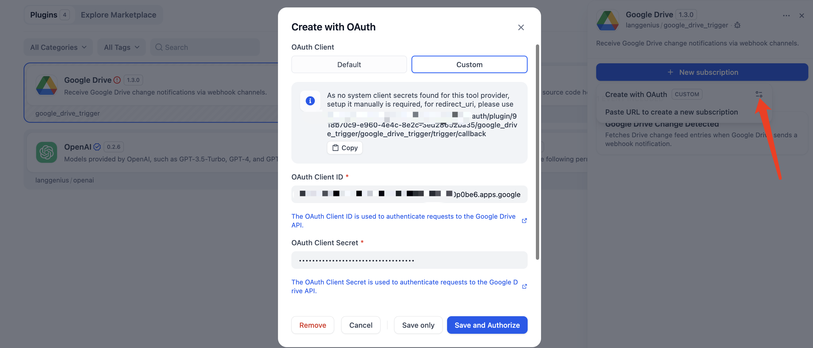

# Google Drive Trigger Plugin User Guide

## What This Plugin Does

- Automatically starts your Dify workflows when Google Drive notifies us about file or drive changes.
- Keeps your automations in sync without polling by subscribing to Google’s change notifications.
- Lets you narrow down which files matter by matching names with wildcard patterns directly inside the workflow.

## Step 1: Connect Your Google Account with OAuth

1. Open the Google Drive Trigger Plugin in Dify and click **New Subscription** → **Create with OAuth**.
2. Sign in with the Google account you want to monitor and approve the consent screen. Dify’s managed OAuth client (hosted in the Dify Cloud service) handles the redirect and token storage for you.

> Tip: The default scopes already cover change notifications (`https://www.googleapis.com/auth/drive.metadata.readonly https://www.googleapis.com/auth/drive.appdata`). Only change them if you know you need broader access.

### Optional: Bring Your Own OAuth Client

If your organization requires using its own Google OAuth credentials:

1. Visit [Google Cloud Console](https://console.cloud.google.com/), create (or reuse) a project, and enable the **Google Drive API**.
2. In **APIs & Services → Credentials**, create an **OAuth client ID** (Web application).
3. When Dify asks for an authorized redirect URI, paste the callback URL shown in the subscription dialog, then copy the generated **Client ID** and **Client Secret** back into Dify.
4. Reconnect following the same consent flow—this time using your custom client when prompted.

## Step 2: Configure What to Watch

Inside the trigger subscription dialog you can fine-tune how Google Drive sends updates:

- **Spaces** (`drive`, `appDataFolder`): choose the Drive spaces you care about. “My Drive” must stay selected if you want regular file changes.
- **Include removed items**: enable if you need to capture deletions or removals.
- **Restrict to my drive**: limit the watch to your personal My Drive. Leave off to monitor shared drives or files shared with you.
- **Include items from all drives / Supports all drives**: turn these on if your automation should react to shared drives owned by others or the entire organization.

You can revisit these settings any time to adjust the scope without redoing the OAuth handshake.

## Step 3: Use the Trigger in a Workflow

1. Open your workflow in the Dify builder and add the **Google Drive Change Detected** trigger.
2. In the trigger node, use **File name pattern** to decide which files start the flow. Patterns support wildcards and multiple entries (e.g., `*.pdf, reports_??.xlsx`).
3. Optionally choose **Change types** (`file`, `drive`) to focus on file metadata or shared drive-level changes.
4. Publish the workflow. Dify keeps the watch channel active and delivers the structured change payload to your downstream nodes.

> Example: Use `contracts/*.docx` to run a review automation only when Word contracts inside the `contracts` folder change.

## What You Receive in Each Trigger

The trigger returns a list of change objects from the Google Drive Change API, including:

- `changes`: each entry includes `change_type`, `file_id`, metadata like `file.name`, owners, and timestamps.
- `subscription`: watch channel details (`channel_id`, expiration) so you can monitor health.
- `headers` & `body`: the raw webhook package signed by Google if you need to validate or log it.

You can pass these fields directly to tools, models, or other workflow steps to build validations, notifications, or sync jobs.
