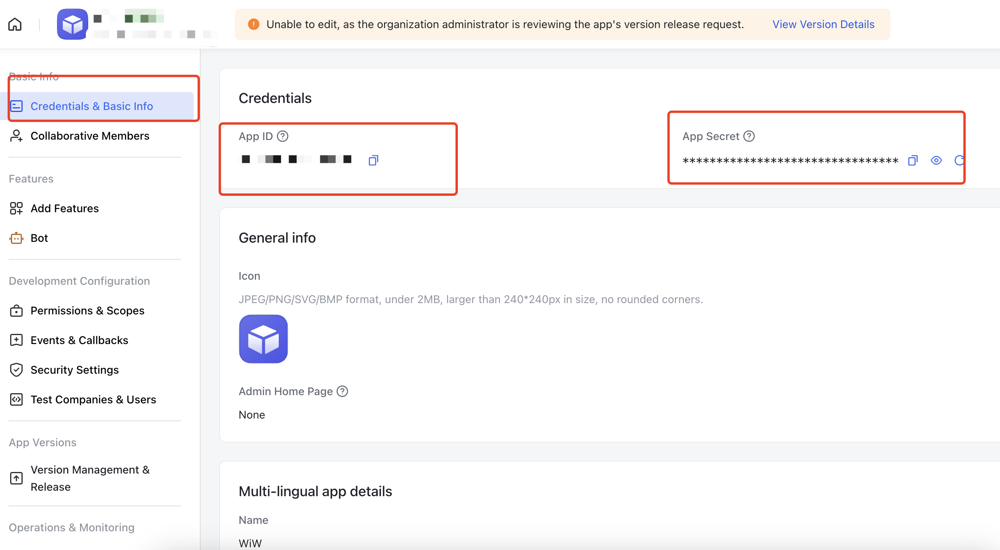
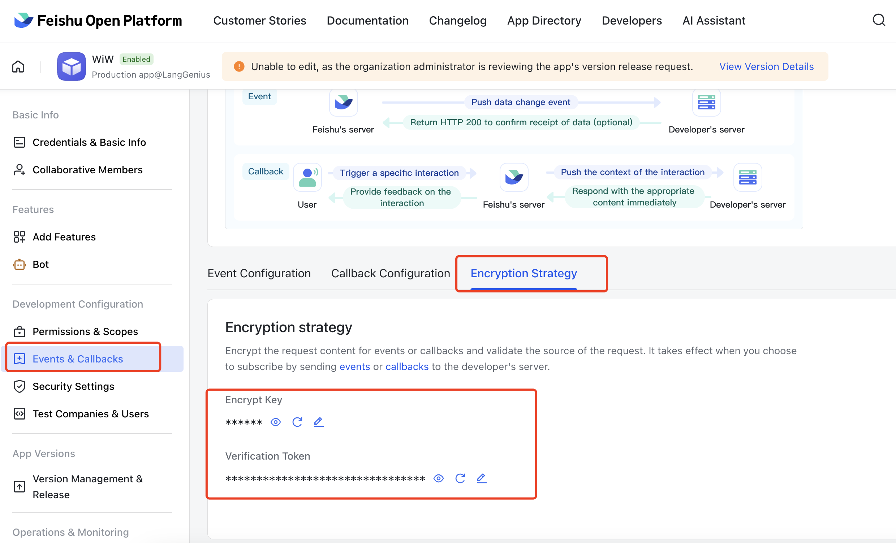
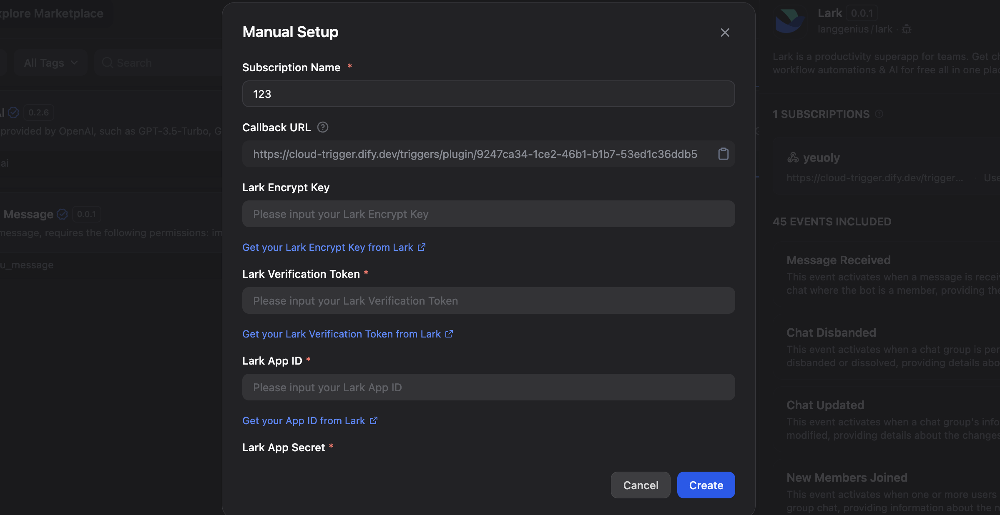
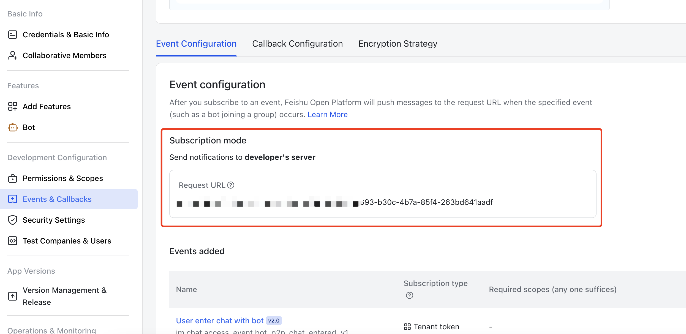
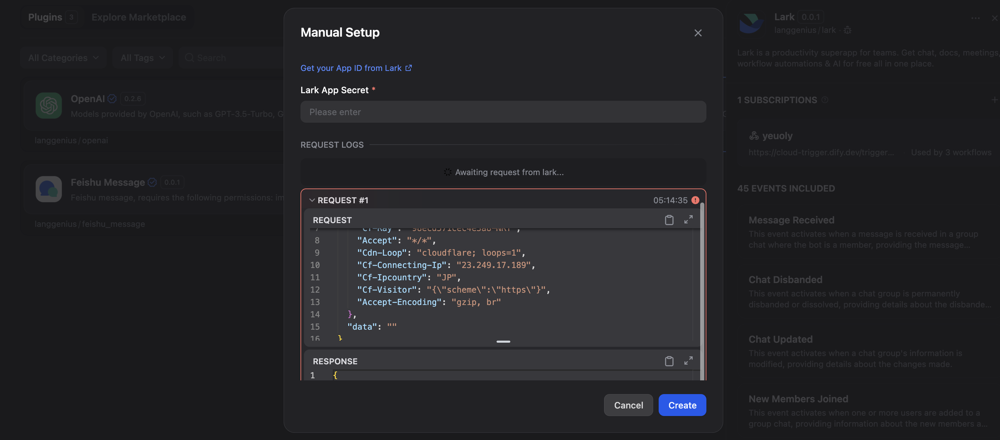
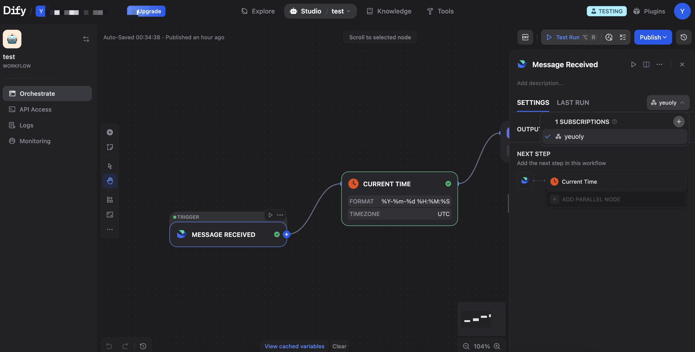

# Lark Trigger Plugin User Guide

## What This Plugin Does

The Lark Trigger plugin connects your Dify workflows with Lark (Feishu) events. When something happens in your Lark workspace - like receiving a message, creating a file, or joining a meeting - this plugin automatically starts your Dify workflows to respond to these events.

## Getting Started

### Step 1: Set Up Your Lark App

1. Go to the [Lark Open Platform](https://open.larksuite.com/) and create a new app
2. In your app settings, find and save these four pieces of information:
   - **App Credentials**: Could be found in `Credentials & Basic Info` section
      - **App ID**: A unique identifier for your app
      - **App Secret**: Your app's password (keep this secure!)
   - **Event Subscriptions**: Could be found in `Events & Callbacks` section
      - **Encrypt Key**: Used to encrypt the event data, it's optional in Lark, but we require it in this Plugin
      - **Verification Token**: Used to confirm events are really from Lark

### Step 2: Configure Event Subscriptions in Both Lark and Dify

1. Return to your Dify plugins page and find the "Lark Trigger" plugin, you will find `Subscription` section after clicking the plugin
2. Fill in the credentials you got from Lark

3. Attention: copy the `Callback URL` appeared here, and scroll down to the bottom of the dialog, `REQUEST LOGS` is what we need to check later.
4. Go to your Lark app settings, and find `Events & Callbacks` section, and set your Request URL to the `Callback URL` you got from Dify.

5. The final step, save your Lark app settings, a test request is going to be sent to your Dify workspace, you can see the request in the `REQUEST LOGS` section we mentioned before.

6. It's a failure example in the screenshot, but don't worry, you will get a success message if you follow the steps correctly, just click `create` button to save your settings.

### Step 3: Use it in your Dify workflows

Never forget to select the right subscriptions and events.

## Available Events

### Messages & Chat (IM)

#### Message Receive (`message_receive_v1`)

- **What triggers it**: Any new message in a chat where your bot is present
- **What you get**: Message content, sender details, chat information, message type
- **Example use**: Auto-reply bots, message logging, keyword detection

#### Message Read (`message_read_v1`)

- **What triggers it**: When users read messages
- **What you get**: Reader information, message IDs, read timestamps
- **Example use**: Read receipts tracking, engagement analytics

#### Message Recalled (`message_recalled_v1`)

- **What triggers it**: When a message is withdrawn/recalled
- **What you get**: Recalled message ID, recall time, operator details
- **Example use**: Audit trails, compliance monitoring

#### Message Reaction Added (`message_reaction_added_v1`)

- **What triggers it**: When someone adds an emoji reaction to a message
- **What you get**: Reaction type, message ID, reactor information, action time
- **Example use**: Sentiment analysis, poll tracking, engagement metrics

#### Message Reaction Deleted (`message_reaction_deleted_v1`)

- **What triggers it**: When someone removes an emoji reaction
- **What you get**: Removed reaction details, message ID, operator information
- **Example use**: Reaction change tracking, updated sentiment analysis

#### Chat Updated (`chat_updated_v1`)

- **What triggers it**: When chat group information changes
- **What you get**: Updated chat details, change type, operator information
- **Example use**: Group settings monitoring, compliance tracking

#### Chat Disbanded (`chat_disbanded_v1`)

- **What triggers it**: When a chat group is disbanded/deleted
- **What you get**: Chat ID, disband time, operator details
- **Example use**: Archive management, cleanup workflows

#### Chat Member User Added (`chat_member_user_added_v1`)

- **What triggers it**: When users are added to a group chat
- **What you get**: New member list, chat details, operator information
- **Example use**: Welcome messages, access provisioning

#### Chat Member User Removed (`chat_member_user_removed_v1`)

- **What triggers it**: When users are removed from a group chat
- **What you get**: Removed users list, chat details, operator information
- **Example use**: Access revocation, farewell messages

#### Chat Member User Withdrawn (`chat_member_user_withdrawn_v1`)

- **What triggers it**: When a user voluntarily leaves a group chat
- **What you get**: User details, chat information, leave time
- **Example use**: Exit surveys, membership tracking

#### Chat Member Bot Added (`chat_member_bot_added_v1`)

- **What triggers it**: When a bot is added to a group chat
- **What you get**: Bot details, chat information, operator details
- **Example use**: Bot initialization, configuration setup

#### Chat Member Bot Deleted (`chat_member_bot_deleted_v1`)

- **What triggers it**: When a bot is removed from a group chat
- **What you get**: Bot details, chat information, operator details
- **Example use**: Cleanup tasks, data archival

### Files & Documents (Drive)

#### File Created (`file_created_v1`)

- **What triggers it**: When a new file or document is created
- **What you get**: File details, creator information, file type, location
- **Example use**: Auto-categorization, backup creation

#### File Edit (`file_edit_v1`)

- **What triggers it**: When a file is edited
- **What you get**: File details, editor information, edit timestamp
- **Example use**: Version tracking, change notifications

#### File Read (`file_read_v1`)

- **What triggers it**: When a file is accessed or viewed
- **What you get**: File details, reader information, access time
- **Example use**: Access logging, popularity tracking

#### File Deleted (`file_deleted_v1`)

- **What triggers it**: When a file is deleted
- **What you get**: File details, deletion operator, delete time
- **Example use**: Recovery workflows, audit logging

#### File Trashed (`file_trashed_v1`)

- **What triggers it**: When a file is moved to trash
- **What you get**: File details, operator information, trash time
- **Example use**: Trash monitoring, recovery reminders

#### File Title Updated (`file_title_updated_v1`)

- **What triggers it**: When a file's title is changed
- **What you get**: Old and new titles, file details, operator information
- **Example use**: Name change tracking, search index updates

#### File Permission Member Added (`file_permission_member_added_v1`)

- **What triggers it**: When sharing permissions are granted
- **What you get**: New member details, permission level, file information
- **Example use**: Access monitoring, security alerts

#### File Permission Member Removed (`file_permission_member_removed_v1`)

- **What triggers it**: When sharing permissions are revoked
- **What you get**: Removed member details, file information, operator details
- **Example use**: Access audit, permission cleanup

#### Bitable Field Changed (`file_bitable_field_changed_v1`)

- **What triggers it**: When a field/column in a bitable is modified
- **What you get**: Table details, field changes, operator information
- **Example use**: Schema tracking, database synchronization

#### Bitable Record Changed (`file_bitable_record_changed_v1`)

- **What triggers it**: When a record in a bitable is created/updated/deleted
- **What you get**: Record details, change type, table information
- **Example use**: Data synchronization, change tracking

### Calendar

#### Calendar Changed (`calendar_changed_v4`)

- **What triggers it**: When calendar properties are modified
- **What you get**: Calendar details, changed properties, operator information
- **Example use**: Settings synchronization, audit trails

#### Calendar ACL Created (`calendar_acl_created_v4`)

- **What triggers it**: When users gain access to a calendar
- **What you get**: Granted permissions, recipient details, calendar information
- **Example use**: Access provisioning, permission tracking

#### Calendar ACL Deleted (`calendar_acl_deleted_v4`)

- **What triggers it**: When calendar access is revoked
- **What you get**: Revoked permissions, affected users, calendar details
- **Example use**: Access cleanup, security monitoring

#### Event Changed (`event_changed_v4`)

- **What triggers it**: When a calendar event is created/updated/deleted
- **What you get**: Event details, change type, attendee list
- **Example use**: Meeting reminders, schedule synchronization

### Organization & People (Contact)

#### User Created (`user_created_v3`)

- **What triggers it**: When a new user is added to the organization
- **What you get**: User profile, department, contact information
- **Example use**: Onboarding automation, account provisioning

#### User Updated (`user_updated_v3`)

- **What triggers it**: When user information is modified
- **What you get**: Updated fields, user details, change timestamp
- **Example use**: Profile synchronization, change notifications

#### User Deleted (`user_deleted_v3`)

- **What triggers it**: When a user is removed from the organization
- **What you get**: User details, deletion time, operator information
- **Example use**: Offboarding workflows, access revocation

#### Department Created (`department_created_v3`)

- **What triggers it**: When a new department is created
- **What you get**: Department details, hierarchy, initial members
- **Example use**: Org chart updates, team setup

#### Department Updated (`department_updated_v3`)

- **What triggers it**: When department information changes
- **What you get**: Updated details, department hierarchy, change type
- **Example use**: Structure synchronization, reporting updates

#### Department Deleted (`department_deleted_v3`)

- **What triggers it**: When a department is removed
- **What you get**: Department details, affected users, deletion time
- **Example use**: Reorganization workflows, member reassignment

#### Scope Updated (`scope_updated_v3`)

- **What triggers it**: When contact visibility scope changes
- **What you get**: Added/removed users, departments, and groups
- **Example use**: Privacy management, visibility control

### Video Conferencing (VC)

#### Meeting Started (`meeting_started_v1`)

- **What triggers it**: When a video conference begins
- **What you get**: Meeting details, start time, host information
- **Example use**: Attendance tracking, meeting preparation

#### Meeting Ended (`meeting_ended_v1`)

- **What triggers it**: When a video conference ends
- **What you get**: Meeting details, end time, duration
- **Example use**: Meeting summaries, follow-up tasks

#### Join Meeting (`join_meeting_v1`)

- **What triggers it**: When a user joins a meeting
- **What you get**: User details, join time, meeting information
- **Example use**: Attendance logging, late arrival notifications

#### Leave Meeting (`leave_meeting_v1`)

- **What triggers it**: When a user leaves a meeting
- **What you get**: User details, leave time, meeting information
- **Example use**: Early departure tracking, attendance duration

#### Recording Started (`recording_started_v1`)

- **What triggers it**: When meeting recording begins
- **What you get**: Meeting details, recording start time, operator
- **Example use**: Recording notifications, compliance logging

#### Recording Ended (`recording_ended_v1`)

- **What triggers it**: When meeting recording stops
- **What you get**: Meeting details, recording end time, duration
- **Example use**: Processing triggers, storage management

#### Recording Ready (`recording_ready_v1`)

- **What triggers it**: When a meeting recording is ready for download
- **What you get**: Recording URL, meeting details, file information
- **Example use**: Auto-transcription, archive workflows

### Meeting Rooms

#### Meeting Room Created (`meeting_room_created_v1`)

- **What triggers it**: When a new meeting room is created
- **What you get**: Room details, capacity, equipment information
- **Example use**: Room inventory updates, booking system sync

#### Meeting Room Status Changed (`meeting_room_status_changed_v1`)

- **What triggers it**: When a meeting room's status changes
- **What you get**: Room details, status change, timestamp
- **Example use**: Availability tracking, maintenance scheduling

### Tasks

#### Task Updated (`task_updated_v1`)

- **What triggers it**: When a task is created or modified
- **What you get**: Task details, assignees, status, due date
- **Example use**: Project tracking, deadline reminders

#### Task Comment Updated (`task_comment_updated_v1`)

- **What triggers it**: When a comment is added/updated/deleted on a task
- **What you get**: Comment content, author, task details
- **Example use**: Activity feeds, notification systems

### Approvals

#### Approval Updated (`approval_updated_v4`)

- **What triggers it**: When an approval request status changes
- **What you get**: Approval details, current status, approvers, timeline
- **Example use**: Approval automation, status notifications
