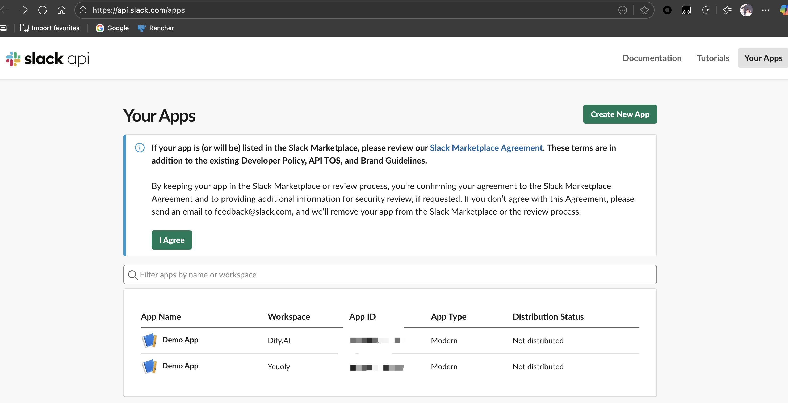
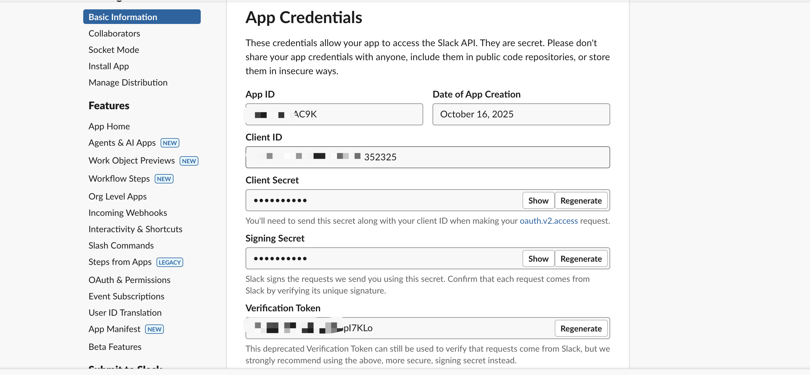
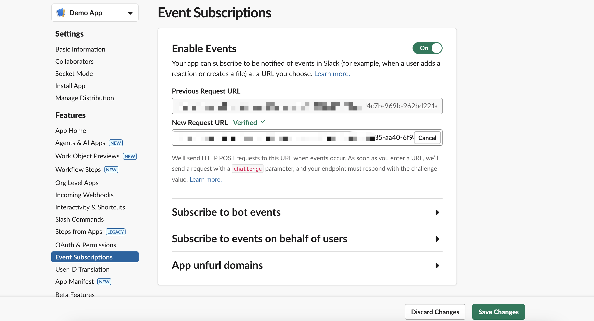
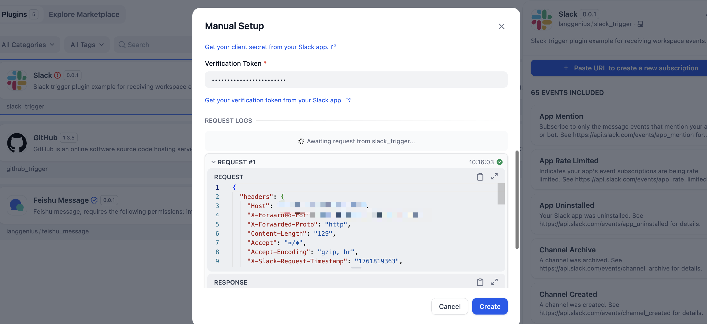

# Slack Trigger Plugin User Guide

## What This Plugin Does

The Slack Trigger plugin connects your Dify workflows with Slack events. When something happens in your Slack workspace - like receiving a message, creating a subtask, or joining a channel - this plugin automatically starts your Dify workflows to respond to these events.

## Getting Started

### Step 1: Set Up Your Slack App

1. (Optional) Go to the [Slack Developer Portal](https://api.slack.com/apps) and create a new app or you've already got one.
   

2. In your app settings, find and save these four pieces of information:
   - **App ID**: App ID which is used to identify your app
   - **Signing Secret**: Used to encrypt the event data, it's optional in Slack, but we require it in this Plugin
   - **Client ID**: Client ID which is used to identify your app
   - **Client Secret**: Client Secret which is used to identify your app
   - **Verification Token**: Verification Token which is used to verify the event data

   

3. Open your Dify plugins page, and find the "Slack Trigger" plugin, create a new subscription using the credentials you got from Slack.

   

   Once you paste `Callback URL` into Slack `Event Subscriptions` section, a log will be sent to you.

   

   

4. Finish, now you can add a `Slack Trigger` event to your workflow, and just enjoy the event-driven workflows!
